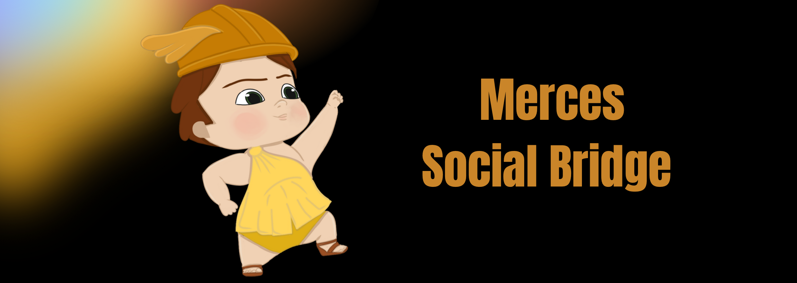

# Merces

website : https://mercestoken.com

## Purpose:

### The project:
Reshape every users of every website as a Banking Account

### For websites
Enable crypto owner to make transfer to my users

### For users
Creating content then let user to transfer money to my account without requiring any information

Merces is a The SocialMedia Banking Account Maker.
His first purpose is to manage transfer from Wallet to Social Media Accounts.
Any people receiving Coin on his Social Media can transfer received money on his Main Wallet.

## Concepts:

DNS : (Domain Name Service) it register and keep ownership link between web DOMAIN and Public Key
Example:

|   Domain            |        Publickey        |
| :------------------ | :---------------------- |
|   mercestoken.com   |        XXXX         |
|   facebook.com      |       YYYY         |

When claiming a domain you can manager UNS in your scope

UNS : (User Name Service) it register and keep ownership link between User of a Domain and its Public Key
Example: in 'mercestoken.com' scope

|   Username   |        Publickey  |
| :----------- | :-------------------------| 
|   Alice 	 |        AAAAAAAA       |
|   Bob		  |	      BBBBBBBB       |

As a user you delegate rights to one PublicKey. Then the Publickey signing transactions can get back money sent to the Account

## Example of process:
* any-social-media.com     : HEY I am any-social-media.com  
* Bob (on the website)     : HEY I am Bob I delegate rights to PublicKey BBBB  
* Alice (on the website)   : HEY I am Alice I delegate rights to PublicKey AAAA  
* AAAA (on Merces Network) : HEY transfer X token to 'Bob' being user of 'any-social-media.com'  
* BBBB (on Merces Network) : HEY get back all my money I got on 'Bob' of 'any-social-mecia.com'  
